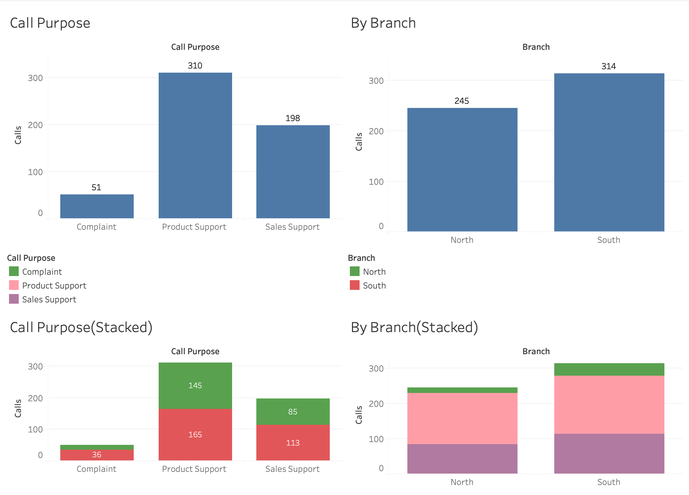

# Sales Representative Caller Analysis

An interactive Tableau project analyzing sales representative call activity to identify performance trends, call volume patterns, and top-performing representatives.

## Project Objective

The objective of this project was to analyze inbound and outbound call activity across sales representatives and branches, then present the results in a clear dashboard that supports performance comparison and business decision-making.

## Tools Used

- Tableau
- Data Visualization
- Exploratory Data Analysis
- Dashboard Design
- Business Analysis

## Analysis Performed

- Compared incoming and outgoing call volumes by sales representative
- Identified top representatives based on outbound call activity
- Analyzed total calls handled during key business hours
- Compared call purposes such as complaints, product support, and sales support
- Compared performance across different branches
- Built dashboards to summarize representative and branch-level activity

## Dashboard

The Tableau dashboard was designed to make representative and branch performance easy to compare.

### Dashboard Features

- Incoming vs. outgoing call analysis
- Top outbound sales representatives
- Call activity during selected time periods
- Branch-level comparisons
- Call-purpose breakdowns
- Interactive visual summaries

## Key Takeaways

This project demonstrates my ability to analyze operational business data, compare employee performance, and communicate results through interactive dashboards.

It also strengthened my skills in Tableau dashboard development, visual storytelling, and business-focused data analysis.
